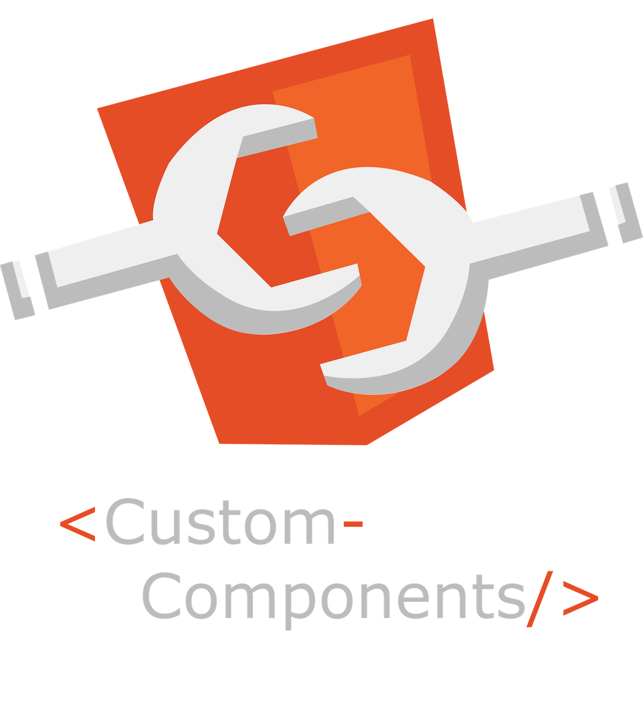

## Custom Web Components

<a href="http://gitub.com/ajnauleau/custom-components">
    
</a>

Make and style custom web components easily!


## Installation

```node
$ npm install --save @ajnauleau/custom-components
```

## Style

First start out by adding css styles to your component:

```javascript
import Component from '@ajnauleau/custom-components';


const Custom = Component.styled`
    color: red;
    background: black;
`;
```

## Extend

Extend your component by adding any valid HTML between template literals ` `` `:

```javascript
class WebComponent extends Custom {

    constructor() {
        super();
    }

    render() {
        let world = 'world';
        return (
            `<div>
                <p>hello ${world}</p>
             <div>
             `
        )
    }
}
```

## Render

Render your new web component and give it a custom name. REMEMBER! Web component names must use a hyphen (-).

```javascript
customElements.define('custom-component', WebComponent);
```


## Result

Embed and link your javascript, then use your new custom component.

```html
<html>
    <body>
        <custom-component>
        </custom-component>
        <script type="module" src="./index.js"></script>
    </body>
</html>
```


## Summary

```javascript
import Component from '@ajnauleau/custom-components';


const Custom = Component.styled`
    color: red;
    background: black;
`;


class WebComponent extends Custom {

    constructor() {
        super();
    }

    render() {
        return (
            `<p>hello</p>`
        )
    }

}


customElements.define('custom-component', WebComponent);
```

__________________________________________________________

<h4>Coming Soon!</h4>

## Access Props

Attribute to Props, similar to React


## Lifecycle

constructor()

render()

componentDidMount()

componentDidUpdate()

componentWillUnmount()

